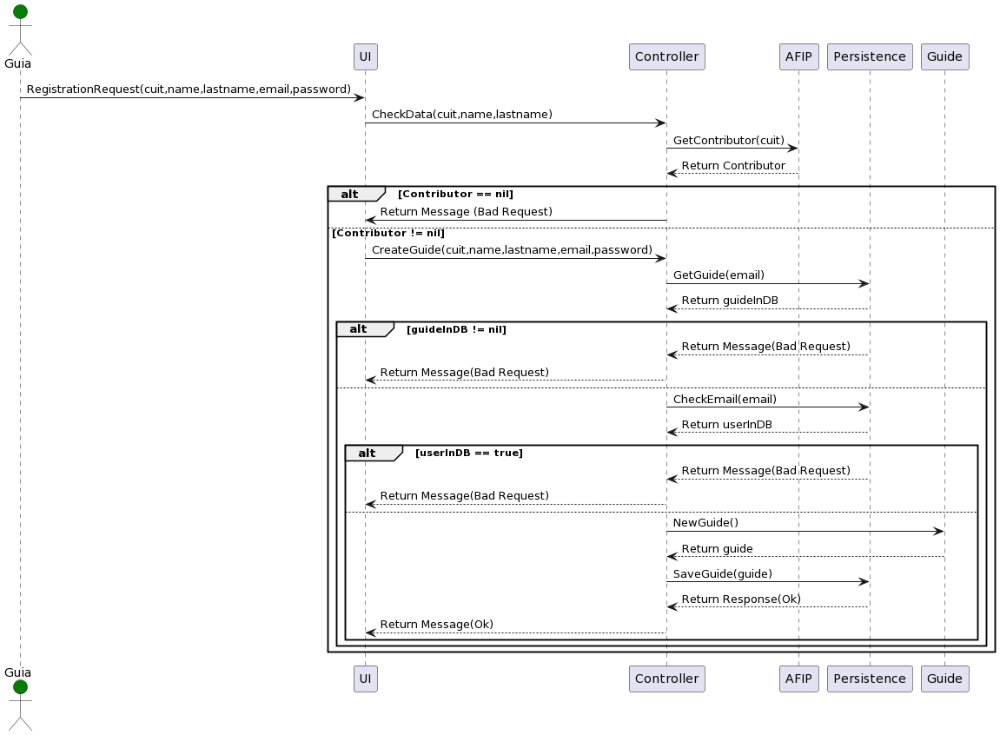

### Procesar registro de Guía.

Este caso de uso es el encargado de procesar el registro de un guía.

El proceso es el siguiente:

1. El sistema solicita al guía registrarse mediante cuit, nombre, apellido, correo y contraseña.
2. El guía ingresa los datos.
3. Se valida si existe un contribuidor en AFIP con el CUIT registrado.
    1. Si el contribuidor no existe se retorna un mensaje de error y finaliza el proceso.
    2. Si el contribuidor existe se valida que el nombre y apellido coincidan. Si no coinciden se retorna un mensaje de error y finaliza
       el proceso.
4. Si la información registrada fue validada correctamente, se crea el guía. Para ello se valida que tanto el guía como el correo no
   existan previamente. De lo contrario se retorna un mensaje de error y finaliza el proceso.
5. Si el guía se guarda correctamente se retorna un mensaje de éxito y finaliza el proceso.
