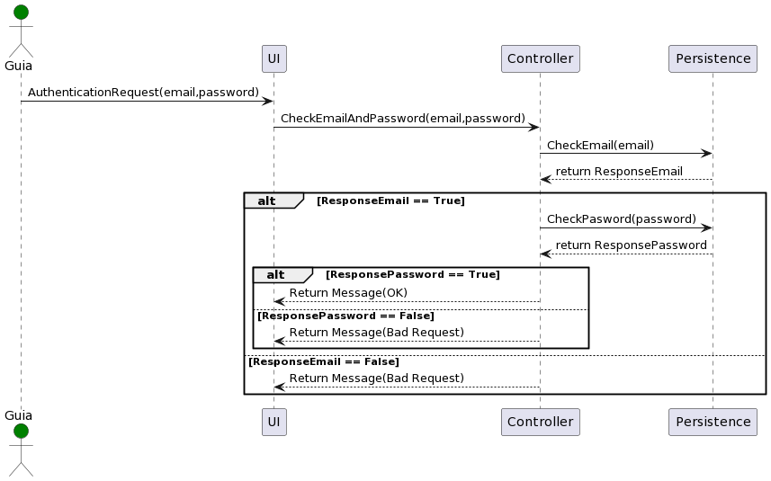

### Procesar logín de Guía.

Este caso de uso es el encargado de procesar el login de un guía.

El proceso es el siguiente:

1. El sistema solicita al guía autenticarse mediante correo y contraseña.
2. El guía ingresa los datos.
3. Se valida si el correo ingresado existe:
    1. Si el correo no existe se retorna un mensaje de error y finaliza el proceso.
    2. Si el correo existe se busca la contraseña para ese correo.
4. Se valida que la contraseña obtenida sea igual a la ingresada.
   1. Si la contraseña es correcta se retorna un mensaje de éxito y finaliza el proceso.
   2. Si la contraseá es incorrecta se retorna un mensaje de error y finaliza el proceso.
