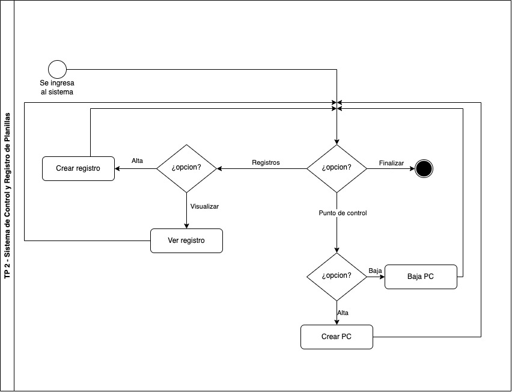
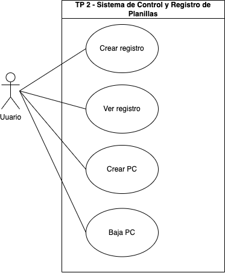

## Diagrama de Flujo:

1. El usuario ingresa al sistema.
2. El usuario selecciona una opcion, de las cuales puede ser:
   1. Registros:
      1. Si el usuario selecciona Registros se le da la opción de:
         1. Dar de alta un registro.
         2. Visualizar un registro.
   2. Puntos de Control:
      1. Si el usuario selecciona PC se le da la opción de:
         1. Dar de alta un PC (a dar de alta un PC se da de alta sus respectivas planillas).
         2. Dar de baja un PC.
   3. Salir del sistema.
3. Al finalizar cualquiera de las opciones elegidas, se le vuelve a preguntar al usuario si desea realizar nuevamente alguna opción.

## Diagrama de Caso de Uso:

